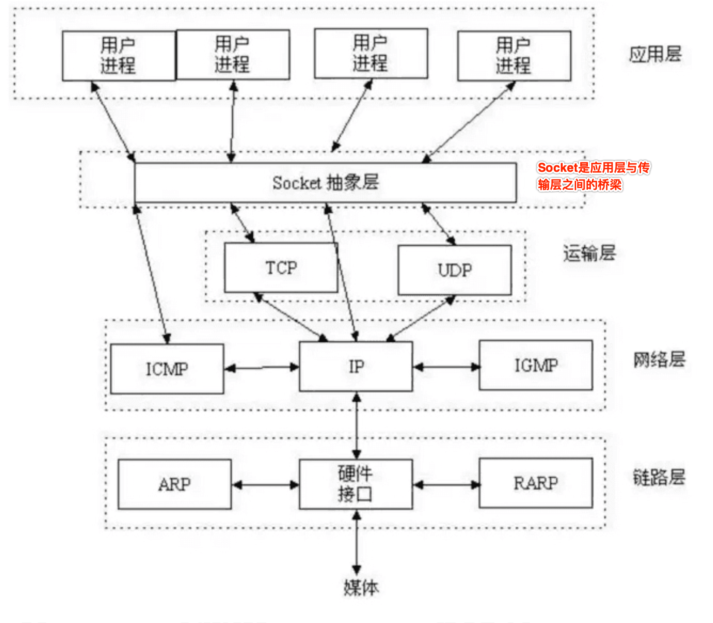
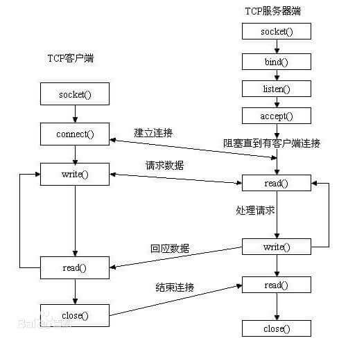
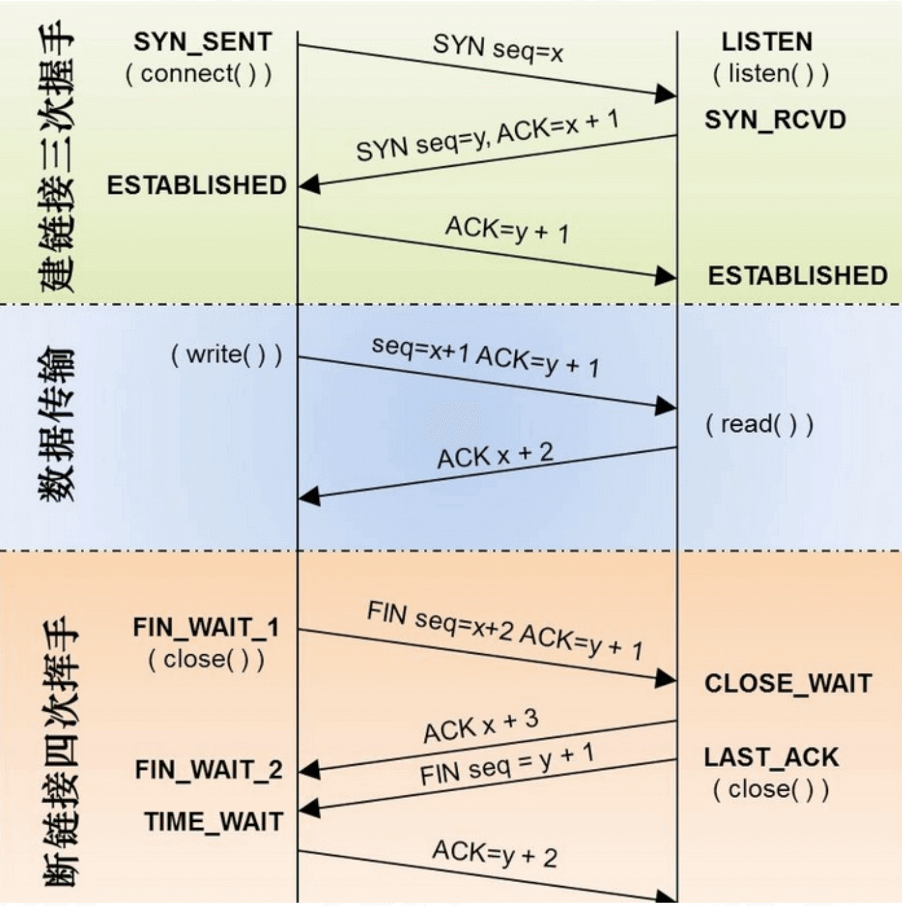
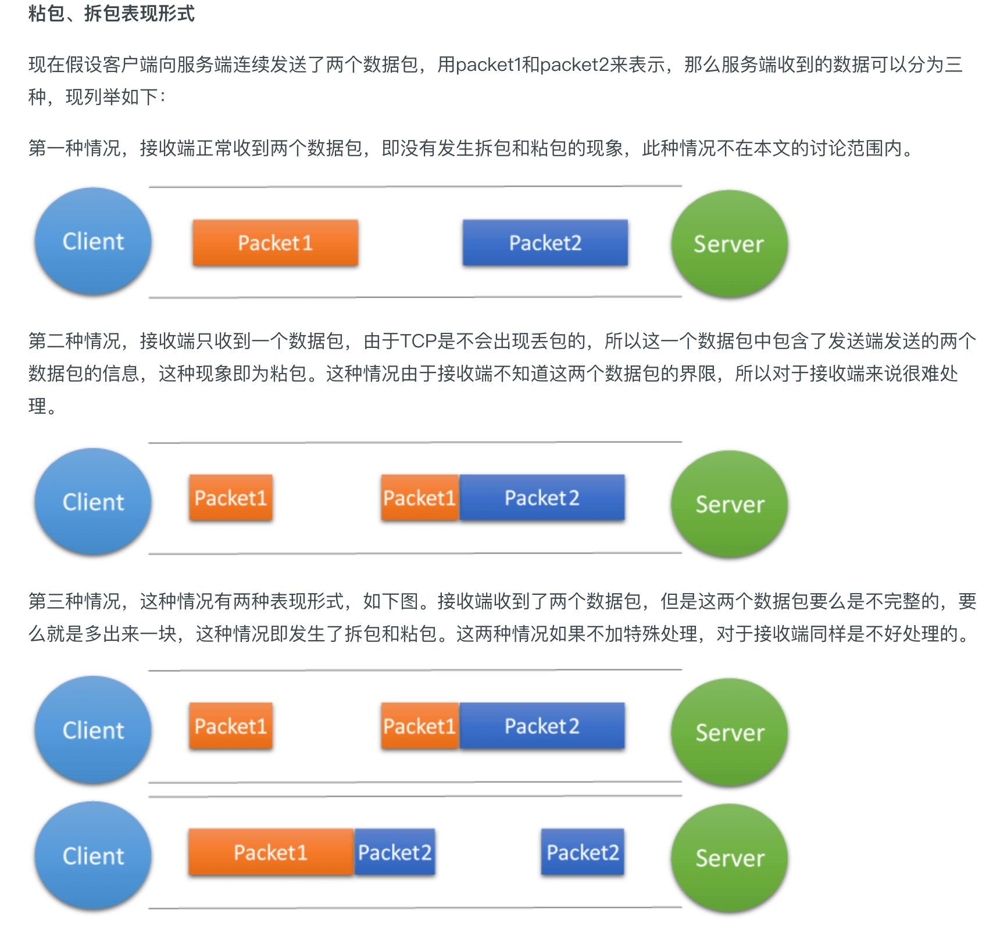

## Socket

### Socket 简介

Socket就是为⽹网络服务提供的⼀一种机制 通信的两端都是 Socket。 网络通信其实就是 Socket 间的通信 数据在两个 Socket 间通过 IO 传输。Socket是纯C语言的,是可以跨平台的。

 


#### UDP
* UDP(⽤户数据报协议) 只管发送，不确认对方是否接收到 将数据及源和⽬的封装成数据包中，不需要建立连接。
* 每个数据报的⼤大⼩小限制在64K之内 因为无需连接，因此是不可靠协议 
* 不需要建⽴立连接，速度快 
* 应⽤用场景:多媒体教室/⽹网络流媒体

#### TCP
TCP(传输控制协议)
* 建⽴连接，形成传输数据的通道 在连接中进行⼤数据传输(数据⼤小不受限制) 
* 通过三次握⼿手完成连接，是可靠协议，安全送达 必须建⽴立连接，效率会稍低


#### 建立连接





具体过程:



 
 
### Socket 的使用

#### 创建socket

```c
    /**
     1: 创建socket
     参数
     domain：协议域，又称协议族（family）。常用的协议族有AF_INET、AF_INET6、AF_LOCAL（或称AF_UNIX，Unix域Socket）、AF_ROUTE等。协议族决定了socket的地址类型，在通信中必须采用对应的地址，如AF_INET决定了要用ipv4地址（32位的）与端口号（16位的）的组合、AF_UNIX决定了要用一个绝对路径名作为地址。
     type：指定Socket类型。常用的socket类型有SOCK_STREAM、SOCK_DGRAM、SOCK_RAW、SOCK_PACKET、SOCK_SEQPACKET等。流式Socket（SOCK_STREAM）是一种面向连接的Socket，针对于面向连接的TCP服务应用。数据报式Socket（SOCK_DGRAM）是一种无连接的Socket，对应于无连接的UDP服务应用。
     protocol：指定协议。常用协议有IPPROTO_TCP、IPPROTO_UDP、IPPROTO_STCP、IPPROTO_TIPC等，分别对应TCP传输协议、UDP传输协议、STCP传输协议、TIPC传输协议。
    
     */
    _clinenId = socket(AF_INET, SOCK_STREAM, 0);
```


> 注意：
> 1.`type`和`protocol`不可以随意组合，如`SOCK_STREAM`不可以跟`IPPROTO_UDP`组合。当第三个参数为0时，会自动选择第二个参数类型对应的默认协议。
> 2.`WindowsSocket`下`protocol`参数中不存在`IPPROTO_STCP`


> 返回值:
>      如果调用成功就返回新创建的套接字的描述符，如果失败就返回`INVALID_SOCKET`（Linux下失败返回-1）
> 


#### 绑定

定义相关的宏

```c
//htons : 将一个无符号短整型的主机数值转换为网络字节顺序，不同cpu 是不同的顺序 (big-endian大尾顺序 , little-endian小尾顺序)
#define SocketPort htons(8040)
//inet_addr是一个计算机函数，功能是将一个点分十进制的IP转换成一个长整数型数
#define SocketIP   inet_addr("127.0.0.1")
```

绑定的代码实现

```
    //2: 建立连接
    
    /**
     __uint8_t    sin_len;          假如没有这个成员，其所占的一个字节被并入到sin_family成员中
     sa_family_t    sin_family;     一般来说AF_INET（地址族）PF_INET（协议族）
     in_port_t    sin_port;         // 端口
     struct    in_addr sin_addr;    // ip
     char        sin_zero[8];       没有实际意义,只是为了　跟SOCKADDR结构在内存中对齐
     */
    
    struct sockaddr_in socketAddr;
    socketAddr.sin_family   = AF_INET;
    socketAddr.sin_port     = SocketPort;
    struct in_addr  socketIn_addr;
    socketIn_addr.s_addr    = SocketIP;
    socketAddr.sin_addr     = socketIn_addr;
    /**
     参数
     参数一：套接字描述符
     参数二：指向数据结构sockaddr的指针，其中包括目的端口和IP地址
     参数三：参数二sockaddr的长度，可以通过sizeof（struct sockaddr）获得
     返回值
     成功则返回0，失败返回非0，错误码SOCKET_ERROR。
     */
    int result = connect(_clinenId, (const struct sockaddr *)&socketAddr, sizeof(socketAddr));

```


#### 接受数据

```
 // 3. 接收数据
    /**
     参数
     1> 客户端socket
     2> 接收内容缓冲区地址
     3> 接收内容缓存区长度
     4> 接收方式，0表示阻塞，必须等待服务器返回数据
     
     返回值
     如果成功，则返回读入的字节数，失败则返回SOCKET_ERROR,应用程序可通过WSAGetLastError()获取相应错误代码
     */
 
    while (1) {
        uint8_t buffer[1024];
        ssize_t recvLen = recv(self.clinenId, buffer, sizeof(buffer), 0);
        NSLog(@"接收到了:%ld字节",recvLen);
        // 判断如果 0  下面会奔溃
        if (recvLen==0) {
            self.restartId ++;
            if (self.restartId>3) {
                self.restartId = 0;
                return;
            }
            NSLog(@"此次传输长度为0 如果下次还为0 请检查连接");
            continue;
        }
        
        // 接收到的数据转换
        NSData *recvData  = [NSData dataWithBytes:buffer length:recvLen];
        NSString *recvStr = [[NSString alloc] initWithData:recvData encoding:NSUTF8StringEncoding];
```


#### 发送数据


```
   /**
     4: 发送消息
     s：一个用于标识已连接套接口的描述字。
     buf：包含待发送数据的缓冲区。
     len：缓冲区中数据的长度。
     flags：调用执行方式。
     
     返回值
     如果成功，则返回发送的字节数，失败则返回SOCKET_ERROR
     一个中文对应 3 个字节！UTF8 编码！
     */
     
   const char *msg = self.sendMsgContent_tf.text.UTF8String;
    ssize_t sendLen = send(self.clinenId, msg, strlen(msg), 0);
    NSLog(@"发送了:%ld字节",sendLen);
    
```


####  server 监听Socket


```
 //  监听socket
    int listen_result = listen(self.serverId, kMaxConnectCount);
    if (listen_result == -1) {
        NSLog(@"监听失败");
        return;
    }
```


#### server 监听客户端连接

```
 // 接受客户端的链接
struct sockaddr_in client_address;
socklen_t address_len;
// accept函数
int client_socket = accept(self.serverId, (struct sockaddr *)&client_address, &address_len);
self.client_socket = client_socket;

if (client_socket == -1) {
            NSLog(@"接受 %u 客户端错误",address_len);
            
}else{
            NSString *acceptInfo = [NSString stringWithFormat:@"客户端 in,socket:%d",client_socket];
            NSLog(@"%@",acceptInfo);
            [self receiveMsgWithClietnSocket:client_socket];
        }
```

循环监听客户端是否发送数据过来

```
   while (1) {
        // 接受客户端传来的数据
        char buf[1024] = {0};
        long iReturn = recv(clientSocket, buf, 1024, 0);
        if (iReturn>0) {
            NSLog(@"客户端来消息了");
            // 接收到的数据转换
            NSData *recvData  = [NSData dataWithBytes:buf length:iReturn];
            NSString *recvStr = [[NSString alloc] initWithData:recvData encoding:NSUTF8StringEncoding];
            NSLog(@"%@",recvStr);
            
        }else if (iReturn == -1){
            NSLog(@"读取消息失败");
            break;
        }else if (iReturn == 0){
            NSLog(@"客户端走了");
            
            close(clientSocket);
            
            break;
        }
    }

```

#### 关闭连接

```
   // 关闭socket连接
    int close_result = close(self.client_socket);
    
    if (close_result == -1) {
        NSLog(@"socket 关闭失败");
        return;
    }else{
        NSLog(@"socket 关闭成功");
    }
```


### 粘包、拆包

#### 什么粘包、拆包



#### 粘包、拆包发生原因
发生TCP粘包或拆包有很多原因，现列出常见的几点，可能不全面，欢迎补充，

1、要发送的数据大于TCP发送缓冲区剩余空间大小，将会发生拆包。

2、待发送数据大于MSS（最大报文长度），TCP在传输前将进行拆包。

3、要发送的数据小于TCP发送缓冲区的大小，TCP将多次写入缓冲区的数据一次发送出去，将会发生粘包。

4、接收数据端的应用层没有及时读取接收缓冲区中的数据，将发生粘包

####  粘包、拆包解决办法
通过以上分析，我们清楚了粘包或拆包发生的原因，那么如何解决这个问题呢？解决问题的关键在于如何给每个数据包添加边界信息，常用的方法有如下几个：

1、发送端给每个数据包添加包首部，首部中应该至少包含数据包的长度，这样接收端在接收到数据后，通过读取包首部的长度字段，便知道每一个数据包的实际长度了。

2、发送端将每个数据包封装为固定长度（不够的可以通过补0填充），这样接收端每次从接收缓冲区中读取固定长度的数据就自然而然的把每个数据包拆分开来。

3、可以在数据包之间设置边界，如添加特殊符号，这样，接收端通过这个边界就可以将不同的数据包拆分开。

等等


### 代码
#### 客户端代码

```objective-c

#import "ViewController.h"
#import <sys/socket.h>
#import <netinet/in.h>
#import <arpa/inet.h>

//htons : 将一个无符号短整型的主机数值转换为网络字节顺序，不同cpu 是不同的顺序 (big-endian大尾顺序 , little-endian小尾顺序)
#define SocketPort htons(8040)
//inet_addr是一个计算机函数，功能是将一个点分十进制的IP转换成一个长整数型数
#define SocketIP   inet_addr("127.0.0.1")

@interface ViewController ()
@property (nonatomic, assign) int clinenId;
@property (weak, nonatomic) IBOutlet UITextField *sendMsgContent_tf;
@property (weak, nonatomic) IBOutlet UITextView *allMsgContent_tv;
@property (nonatomic, strong) NSMutableAttributedString *totalAttributeStr;
@property (nonatomic, copy) NSString *recoderTime;
@property (nonatomic, assign) int restartId;

@end

@implementation ViewController

- (void)viewDidLoad {
    [super viewDidLoad];
    
    self.allMsgContent_tv.editable = NO;
    self.totalAttributeStr = [[NSMutableAttributedString alloc] init];
}

#pragma mark - 创建socket建立连接
- (IBAction)socketConnetAction:(UIButton *)sender {
    
    /**
     1: 创建socket
     参数
     domain：协议域，又称协议族（family）。常用的协议族有AF_INET、AF_INET6、AF_LOCAL（或称AF_UNIX，Unix域Socket）、AF_ROUTE等。协议族决定了socket的地址类型，在通信中必须采用对应的地址，如AF_INET决定了要用ipv4地址（32位的）与端口号（16位的）的组合、AF_UNIX决定了要用一个绝对路径名作为地址。
     type：指定Socket类型。常用的socket类型有SOCK_STREAM、SOCK_DGRAM、SOCK_RAW、SOCK_PACKET、SOCK_SEQPACKET等。流式Socket（SOCK_STREAM）是一种面向连接的Socket，针对于面向连接的TCP服务应用。数据报式Socket（SOCK_DGRAM）是一种无连接的Socket，对应于无连接的UDP服务应用。
     protocol：指定协议。常用协议有IPPROTO_TCP、IPPROTO_UDP、IPPROTO_STCP、IPPROTO_TIPC等，分别对应TCP传输协议、UDP传输协议、STCP传输协议、TIPC传输协议。
     注意：1.type和protocol不可以随意组合，如SOCK_STREAM不可以跟IPPROTO_UDP组合。当第三个参数为0时，会自动选择第二个参数类型对应的默认协议。
     返回值:
     如果调用成功就返回新创建的套接字的描述符，如果失败就返回INVALID_SOCKET（Linux下失败返回-1）
     */
    _clinenId = socket(AF_INET, SOCK_STREAM, 0);
    
    if (_clinenId == -1) {
        NSLog(@"创建socket 失败");
        return;
    }
    
    //2: 建立连接
    
    /**
     __uint8_t    sin_len;          假如没有这个成员，其所占的一个字节被并入到sin_family成员中
     sa_family_t    sin_family;     一般来说AF_INET（地址族）PF_INET（协议族）
     in_port_t    sin_port;         // 端口
     struct    in_addr sin_addr;    // ip
     char        sin_zero[8];       没有实际意义,只是为了　跟SOCKADDR结构在内存中对齐
     */
    
    struct sockaddr_in socketAddr;
    socketAddr.sin_family   = AF_INET;
    socketAddr.sin_port     = SocketPort;
    struct in_addr  socketIn_addr;
    socketIn_addr.s_addr    = SocketIP;
    socketAddr.sin_addr     = socketIn_addr;
    /**
     参数
     参数一：套接字描述符
     参数二：指向数据结构sockaddr的指针，其中包括目的端口和IP地址
     参数三：参数二sockaddr的长度，可以通过sizeof（struct sockaddr）获得
     返回值
     成功则返回0，失败返回非0，错误码GetLastError()。
     */
    int result = connect(_clinenId, (const struct sockaddr *)&socketAddr, sizeof(socketAddr));
    if (result != 0) {
        NSLog(@"连接socket 失败");
        return;
    }
    [sender setTitle:@"已连接" forState:UIControlStateNormal];
    sender.userInteractionEnabled = NO;
    self.restartId = 0;
    NSLog(@"连接成功");
    
    dispatch_async(dispatch_get_global_queue(0, 0), ^{
        [self recvMsg];
    });
    
}

- (void)touchesBegan:(NSSet<UITouch *> *)touches withEvent:(UIEvent *)event{
    
//    if (self.clinenId) {
//        // 7: 关闭socket连接
//        int close_result = close(self.clinenId);
//        
//        if (close_result == -1) {
//            NSLog(@"socket 关闭失败");
//            return;
//        }else{
//            NSLog(@"socket 关闭成功");
//        }
//    }
}

#pragma mark - 发送消息

- (IBAction)sendMsgAction:(id)sender {
    /**
     3: 发送消息
     s：一个用于标识已连接套接口的描述字。
     buf：包含待发送数据的缓冲区。
     len：缓冲区中数据的长度。
     flags：调用执行方式。
     
     返回值
     如果成功，则返回发送的字节数，失败则返回SOCKET_ERROR
     一个中文对应 3 个字节！UTF8 编码！
     */
    if (self.sendMsgContent_tf.text.length==0) {
        NSLog(@"消息为空,无法发送");
        return;
    }
    const char *msg = self.sendMsgContent_tf.text.UTF8String;
    ssize_t sendLen = send(self.clinenId, msg, strlen(msg), 0);
    NSLog(@"发送了:%ld字节",sendLen);
    [self showMsg:self.sendMsgContent_tf.text msgType:0];
    self.sendMsgContent_tf.text = @"";

}


#pragma mark - 接受数据

- (void)recvMsg{
    // 4. 接收数据
    /**
     参数
     1> 客户端socket
     2> 接收内容缓冲区地址
     3> 接收内容缓存区长度
     4> 接收方式，0表示阻塞，必须等待服务器返回数据
     
     返回值
     如果成功，则返回读入的字节数，失败则返回SOCKET_ERROR
     */
 
    while (1) {
        uint8_t buffer[1024];
        ssize_t recvLen = recv(self.clinenId, buffer, sizeof(buffer), 0);
        NSLog(@"接收到了:%ld字节",recvLen);
        // 判断如果 0  下面会奔溃
        if (recvLen==0) {
            self.restartId ++;
            if (self.restartId>3) {
                self.restartId = 0;
                return;
            }
            NSLog(@"此次传输长度为0 如果下次还为0 请检查连接");
            continue;
        }
        
        // 接收到的数据转换
        NSData *recvData  = [NSData dataWithBytes:buffer length:recvLen];
        NSString *recvStr = [[NSString alloc] initWithData:recvData encoding:NSUTF8StringEncoding];
        NSLog(@"%@",recvStr);
        self.restartId = 0;

        dispatch_async(dispatch_get_main_queue(), ^{
            
            [self showMsg:recvStr msgType:1];
        });
    }

}

- (void)showMsg:(NSString *)msg msgType:(int)msgType{
    // 时间处理
    NSString *showTimeStr = [self getCurrentTime];
    if (showTimeStr) {
        NSMutableAttributedString *dateAttributedString = [[NSMutableAttributedString alloc] initWithString:showTimeStr];
        NSMutableParagraphStyle *paragraphStyle = [[NSMutableParagraphStyle alloc] init];
        // 对齐方式
        paragraphStyle.alignment = NSTextAlignmentCenter;
        [dateAttributedString addAttributes:@{NSFontAttributeName:[UIFont systemFontOfSize:13],NSForegroundColorAttributeName:[UIColor blackColor],NSParagraphStyleAttributeName:paragraphStyle} range:NSMakeRange(0, showTimeStr.length)];
        [self.totalAttributeStr appendAttributedString:dateAttributedString];
        [self.totalAttributeStr appendAttributedString:[[NSMutableAttributedString alloc] initWithString:@"\n"]];
    }
    
    NSMutableParagraphStyle *paragraphStyle = [[NSMutableParagraphStyle alloc] init];
    paragraphStyle.headIndent = 20.f;
    NSMutableAttributedString *attributedString;
    if (msgType == 0) { // 我发送的
        attributedString = [[NSMutableAttributedString alloc] initWithString:msg];

        paragraphStyle.alignment = NSTextAlignmentRight;
        [attributedString addAttributes:@{
                                          NSFontAttributeName:[UIFont systemFontOfSize:15],
                                          NSForegroundColorAttributeName:[UIColor whiteColor],
                                          NSBackgroundColorAttributeName:[UIColor blueColor],
                                          NSParagraphStyleAttributeName:paragraphStyle
                                          }
                                  range:NSMakeRange(0, msg.length)];
    }else{
        attributedString = [[NSMutableAttributedString alloc] initWithString:msg];

        [attributedString addAttributes:@{
                                          NSFontAttributeName:[UIFont systemFontOfSize:15],
                                          NSForegroundColorAttributeName:[UIColor blackColor],
                                          NSBackgroundColorAttributeName:[UIColor whiteColor],
                                          NSParagraphStyleAttributeName:paragraphStyle
                                          }
                                  range:NSMakeRange(0, msg.length)];
    }
    [self.totalAttributeStr appendAttributedString:attributedString];
    [self.totalAttributeStr appendAttributedString:[[NSMutableAttributedString alloc] initWithString:@"\n"]];

    self.allMsgContent_tv.attributedText = self.totalAttributeStr;

}

#pragma mark - 显示时间逻辑
- (NSString *)getCurrentTime{
    NSDate *date = [NSDate date];
    NSDateFormatter *dateFormatter = [[NSDateFormatter alloc] init];
    dateFormatter.dateFormat = @"yyyy-MM-dd HH:mm:ss";
    NSString *dateStr = [dateFormatter stringFromDate:date];
    if (!self.recoderTime || self.recoderTime.length == 0) {
        self.recoderTime = dateStr;
        return dateStr;
    }
    NSDate *recoderDate = [dateFormatter dateFromString:self.recoderTime];
    self.recoderTime = dateStr;
    NSTimeInterval timeInter = [date timeIntervalSinceDate:recoderDate];
    NSLog(@"%@--%@ -- %f",date,recoderDate,timeInter);
    if (timeInter<6) {
        return @" ";
    }
    return dateStr;
}


- (void)didReceiveMemoryWarning {
    [super didReceiveMemoryWarning];
    // Dispose of any resources that can be recreated.
}


@end

```


#### 服务端代码


```objective-c

#import "ViewController.h"
#import <sys/socket.h>
#import <netinet/in.h>
#import <arpa/inet.h>

#define SocketPort htons(8040)
#define SocketIP   inet_addr("127.0.0.1")

static int const kMaxConnectCount = 5;

@interface ViewController ()
@property (nonatomic, assign) int serverId;
@property (weak, nonatomic) IBOutlet UITextField *sendMsgContent_tf;
@property (nonatomic, strong) NSMutableAttributedString *totalAttributeStr;
@property (nonatomic, copy) NSString *recoderTime;
@property (nonatomic, assign) int client_socket;

@end

@implementation ViewController

- (void)viewDidLoad {
    [super viewDidLoad];
    
}

#pragma mark - 创建socket建立连接
- (IBAction)socketConnetAction:(UIButton *)sender {
    
    // 1: 创建socket
    self.serverId = socket(AF_INET, SOCK_STREAM, 0);
    
    if (self.serverId == -1) {
        NSLog(@"创建socket 失败");
        return;
    }
    NSLog(@"创建socket 成功");

    struct sockaddr_in socketAddr;
    socketAddr.sin_family   = AF_INET;
    socketAddr.sin_port     = SocketPort;
    struct in_addr  socketIn_addr;
    socketIn_addr.s_addr    = SocketIP;
    socketAddr.sin_addr     = socketIn_addr;
    bzero(&(socketAddr.sin_zero), 8);
    
    // 2: 绑定socket
    int bind_result = bind(self.serverId, (const struct sockaddr *)&socketAddr, sizeof(socketAddr));
    if (bind_result == -1) {
        NSLog(@"绑定socket 失败");
        return;
    }

    NSLog(@"绑定socket成功");
    
    // 3: 监听socket
    int listen_result = listen(self.serverId, kMaxConnectCount);
    if (listen_result == -1) {
        NSLog(@"监听失败");
        return;
    }
    
    NSLog(@"监听成功");
    // 4: 接受客户端的链接
    for (int i = 0; i < kMaxConnectCount; i++) {
        [self acceptClientConnet];
    }
    
}

#pragma mark - 接受客户端的链接

- (void)acceptClientConnet{
    
    // 阻塞线程
    dispatch_async(dispatch_get_global_queue(0, 0), ^{
        struct sockaddr_in client_address;
        socklen_t address_len;
        // accept函数
        int client_socket = accept(self.serverId, (struct sockaddr *)&client_address, &address_len);
        self.client_socket = client_socket;
        
        if (client_socket == -1) {
            NSLog(@"接受 %u 客户端错误",address_len);
            
        }else{
            NSString *acceptInfo = [NSString stringWithFormat:@"客户端 in,socket:%d",client_socket];
            NSLog(@"%@",acceptInfo);
            [self receiveMsgWithClietnSocket:client_socket];
        }

    });
    
}

- (void)receiveMsgWithClietnSocket:(int)clientSocket{
    while (1) {
        // 5: 接受客户端传来的数据
        char buf[1024] = {0};
        long iReturn = recv(clientSocket, buf, 1024, 0);
        if (iReturn>0) {
            NSLog(@"客户端来消息了");
            // 接收到的数据转换
            NSData *recvData  = [NSData dataWithBytes:buf length:iReturn];
            NSString *recvStr = [[NSString alloc] initWithData:recvData encoding:NSUTF8StringEncoding];
            NSLog(@"%@",recvStr);
            
        }else if (iReturn == -1){
            NSLog(@"读取消息失败");
            break;
        }else if (iReturn == 0){
            NSLog(@"客户端走了");
            
            close(clientSocket);
            
            break;
        }
    }
}

#pragma mark -  socket 发送消息

- (IBAction)didClickSendAction:(id)sender {

    // 6: 发送消息
    const char *msg = self.sendMsgContent_tf.text.UTF8String;
    ssize_t sendLen = send(self.client_socket, msg, strlen(msg), 0);
    NSLog(@"发送了:%ld字节",sendLen);
    self.sendMsgContent_tf.text = @"";
}

#pragma mark -  socket 发送消息
- (IBAction)didClickCloseAction:(id)sender {
    
    // 7: 关闭socket连接
    int close_result = close(self.client_socket);
    
    if (close_result == -1) {
        NSLog(@"socket 关闭失败");
        return;
    }else{
        NSLog(@"socket 关闭成功");
    }
}
- (void)didReceiveMemoryWarning {
    [super didReceiveMemoryWarning];
    // Dispose of any resources that can be recreated.
}


@end

```