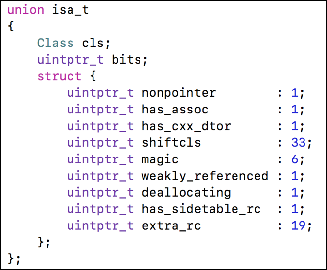
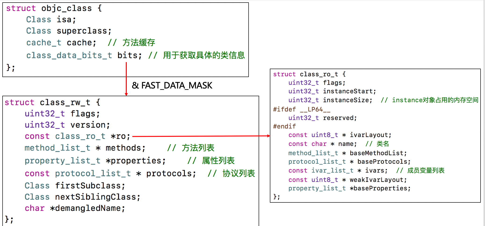
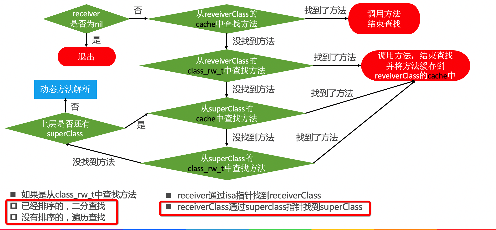
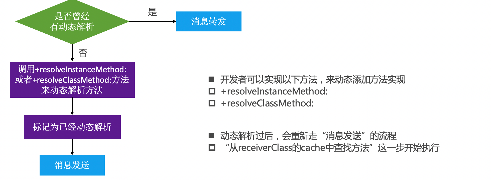

### Runtime面试题集合

#### 讲一下 OC 的消息机制 
OC中的方法调用其实都是转成了objc_msgSend函数的调用，给receiver（方法调用者）发送了一条消息（selector方法名）

objc_msgSend底层有3大阶段
消息发送（当前类、父类中查找）、动态方法解析、消息转发

#### 什么是Runtime？平时项目中有用过么？

* OC是一门动态性比较强的编程语言，允许很多操作推迟到程序运行时再进行
* 
* OC的动态性就是由Runtime来支撑和实现的，Runtime是一套C语言的API，封装了很多动态性相关的函数

* 平时编写的OC代码，底层都是转换成了Runtime API进行调用

具体应用:
```

利用关联对象（AssociatedObject）给分类添加属性

遍历类的所有成员变量（修改textfield的占位文字颜色、字典转模型、自动归档解档）

交换方法实现（交换系统的方法）

利用消息转发机制解决方法找不到的异常问题
```

#### ISA详解

要想学习Runtime，首先要了解它底层的一些常用数据结构，比如isa指针

**在arm64架构之前，isa就是一个普通的指针，存储着Class、Meta-Class对象的内存地址**

**从arm64架构开始，对isa进行了优化，变成了一个共用体（union）结构，还使用位域来存储更多的信息**




##### nonpointer
0，代表普通的指针，存储着Class、Meta-Class对象的内存地址
1，代表优化过，使用位域存储更多的信息

##### has_assoc
是否有设置过关联对象，如果没有，释放时会更快

##### has_cxx_dtor
是否有C++的析构函数（.cxx_destruct），如果没有，释放时会更快

##### shiftcls
存储着Class、Meta-Class对象的内存地址信息

##### magic
用于在调试时分辨对象是否未完成初始化

##### weakly_referenced
是否有被弱引用指向过，如果没有，释放时会更快

##### deallocating
对象是否正在释放

##### extra_rc
里面存储的值是引用计数器减1

##### has_sidetable_rc
引用计数器是否过大无法存储在isa中
如果为1，那么引用计数会存储在一个叫SideTable的类的属性中

#### class结构


#### class_rw_t
class_rw_t里面的methods、properties、protocols是二维数组，是可读可写的，包含了类的初始内容、分类的内容。


#### class_ro_t

class_ro_t里面的baseMethodList、baseProtocols、ivars、baseProperties是一维数组，是只读的，包含了类的初始内容


#### objc_msgSend执行流程
OC中的方法调用，其实都是转换为objc_msgSend函数的调用

objc_msgSend的执行流程可以分为3大阶段:
* 消息发送
* 动态方法解析
* 消息转发


##### objc_msgSend执行流程 – 消息发送



##### objc_msgSend执行流程 – 动态方法解析



##### objc_msgSend执行流程 – 消息转发


