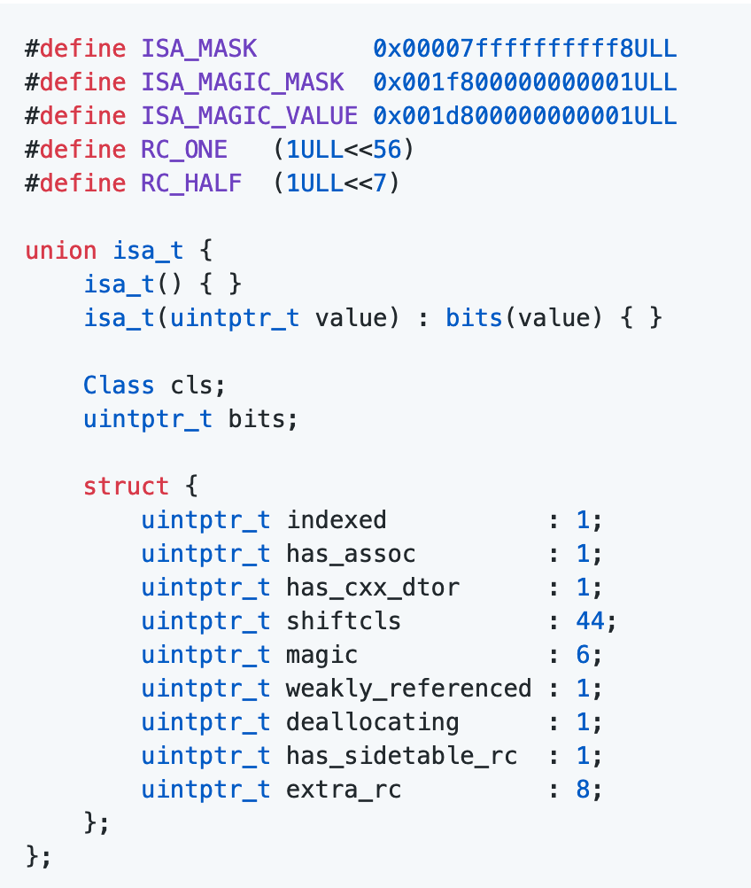
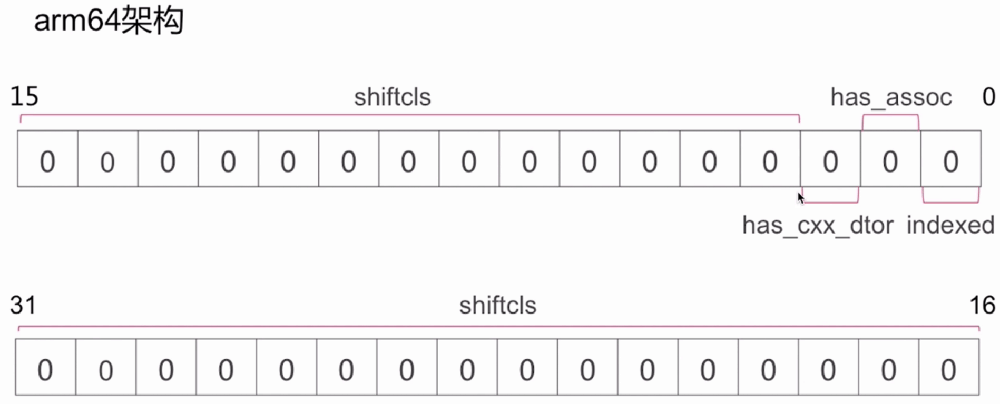
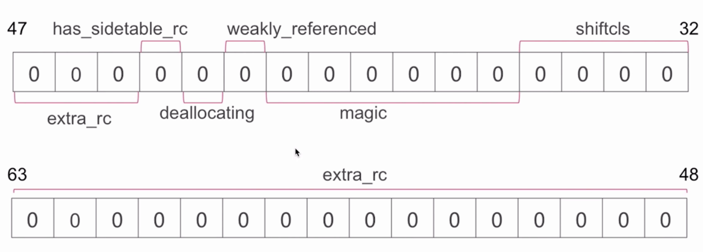
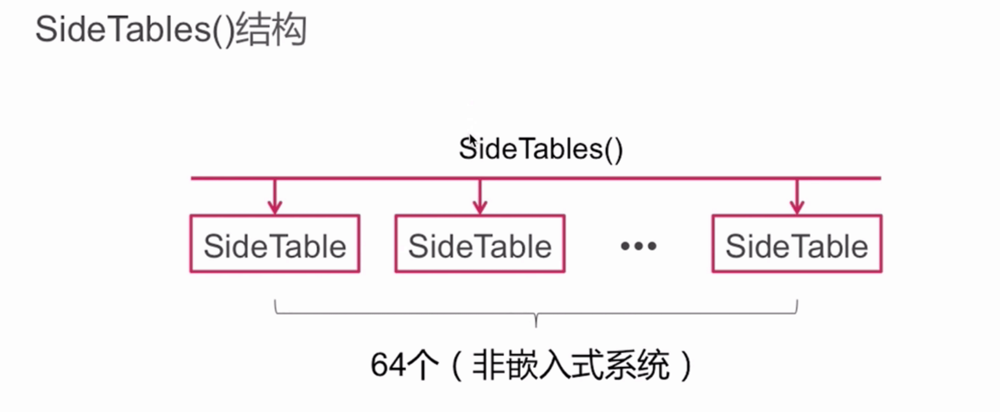
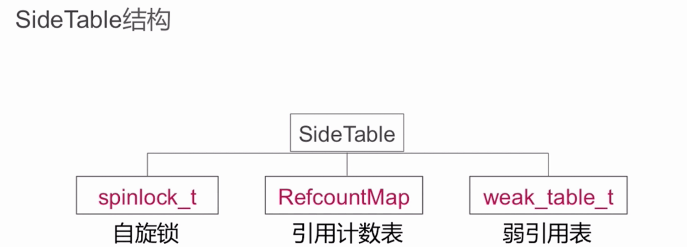
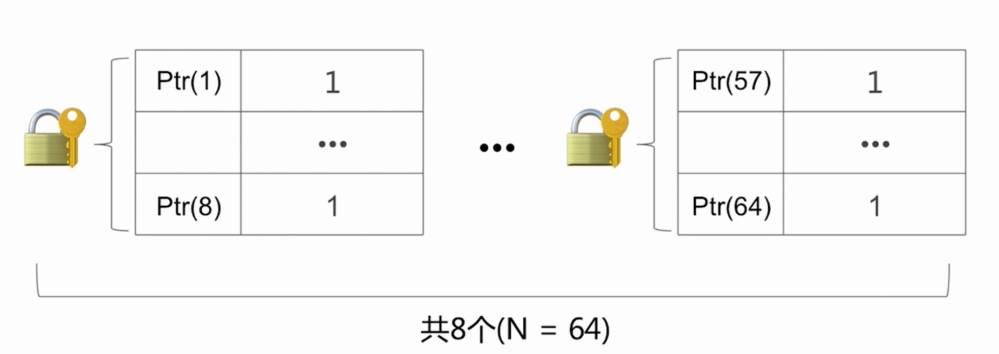

### 内存管理方案相关面试题
 
####  TaggedPointer
对于一些小的对象例如:NSNumber、NSSring, iOS 采用 TaggedPointer的内存管理方案。

#### [NONPOINTER_ISA](https://github.com/draveness/analyze/blob/master/contents/objc/%E4%BB%8E%20NSObject%20%E7%9A%84%E5%88%9D%E5%A7%8B%E5%8C%96%E4%BA%86%E8%A7%A3%20isa.md)
[isa_t](https://stackoverflow.com/questions/252552/why-do-we-need-c-unions) 是一个 union 类型的结构体,也就是说其中的 isa_t、cls、 bits 还有结构体共用同一块地址空间.

非指针型ISA,在64位的架构下,ISA指针占用64位bits,但是实际上33位或者40位就够用了,剩下的位数用来处理有关内存相关的。

**具体的信息**:

**第0位**:indexed位 0表示是个纯的isa指针,里面不包含别的信息，里面的信息直接代表了当前对象的类对象地址。 1表示是非指针型isa,里面的信息还包含了内存管理相关的信息

**第1位**: has_assoc位，表示是否有关联对象0代表没有, 1代表有。

**第2位**: has_cxx_dtor 表示是否有C++语言相关的内容,ARC下也会代表 这个类是都通过ARC管理。

**第3位到第35位**:代表了 对象的类对象地址

**第36位到41位**: magic 的值为 0x3b 用于调试器判断当前对象是真的对象还是没有初始化的空间

**第42位**:weakly_referenced 对象被指向或者曾经指向一个 ARC 的弱变量，没有弱引用的对象可以更快释放

**第43位:**:deallocating 对象正在释放内存

**第44位**:has_sidetable_rc 对象的引用计数太大了，存不下

**第45位-第63位**:extra_rc 对象的引用计数超过 1，会存在这个这个里面，如果引用计数为 10，extra_rc 的值就为 9

#### 散列表
散列表是一个复杂的结构，其中包括了引用计数表和弱引用表。

 SideTables其实是一个哈希表结构,通过对象的地址运算得到对应的Side Table.
 
 
 
 **为什么不是一个Side Table,而是Side Tables?**
 
1. 如果都在一张大表的话,存在效率的问题(成千上万的对象等待加锁 解锁)。

##### 分离锁

 
 
 提高访问的效率,当A和B同时进行引用计数的时候,可以并发执行。
 
##### 怎么实现快速分流
 怎么能够快速的实现从对象快速定位到是哪张Side Table.
 
  